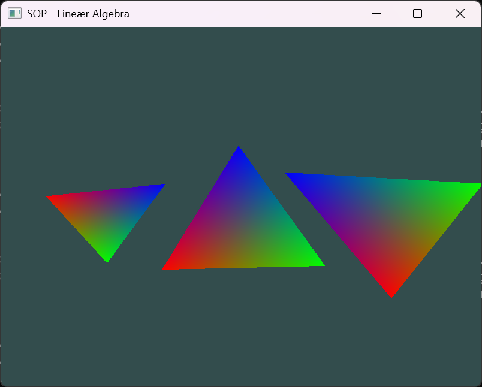

# Studieområdeprojekt - Lineær Algebra

A simple program til show how transformation matricies are used with OpenGL using glm.

## Usage

Remember to download the git submodules!

* `$ git submodule update --init`

Simply build using CMake and run:

* `$ mkdir ./build`
* `$ cd ./build`
* `$ cmake ..`
* `$ cmake --build .`
* `$ ./Debug/SOP.App.exe`

NOTE: This has only been tested for Windows 11 with OpenGL 4.6!

## Contributing

This is for a school project and is not open for contributions.

License
This project is licensed under the MIT License - see the [LICENSE](./LICENSE) file for details.

